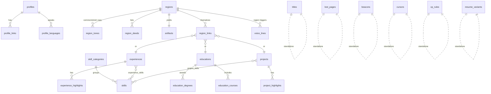

# There and Back Again — Portfolio Content & Data Model

**Konstantin Nikolaev · Interactive Game Portfolio**

This document is the single source of truth for everything the Middle-earth portfolio displays, organized the way it will live in a **SQLite database** (Turso/libSQL-compatible — the same stack used at Agency Collective). Part I is the content itself, compiled from the resume variants, the AgencyCollective documentation vault, and the current hard-coded `src/data/content.ts`. Part II is the database design: entity-relationship model, full DDL, and a migration map showing exactly where each piece of `content.ts` lands.

**Design intent:** the game separates *what is true* (canonical career data: skills, experience, education, projects) from *how it is told* (the game layer: regions, deeds, artifacts, tones, quests). The schema mirrors that split, joined by a bridge table, so updating a resume fact never requires touching narrative copy — and vice versa.

---

# Part I — Portfolio Content

## 1. Profile

| Field | Value |
|---|---|
| Name | Konstantin Nikolaev |
| Headline | Full-Stack Software Engineer |
| Location | Sherman Oaks, CA |
| Phone | (805) 460-8670 |
| Email | konstantin@nikolaev.us |
| Website | knikolaev.com |
| LinkedIn | linkedin.com/in/konn |
| GitHub | github.com/nikolaevK |
| Languages | Russian (native/bilingual) · English (professional working proficiency) |

**Summary.** Full-stack software engineer who architects and ships production applications end-to-end, from database and API design to polished React front-ends. Experienced across the modern TypeScript stack — Next.js, React, and Node.js — building secure multi-tenant platforms, real-time features, payment and third-party integrations, and AI-powered tooling. Comfortable owning projects solo: gathering requirements from stakeholders, researching the problem space, and translating business needs into reliable, well-structured systems. Dual academic background in economics and management supports cross-functional work across product, sales, finance, and operations.

**Alternate headlines** (per resume variant, useful if the portfolio ever offers persona views): *Business & Data Analyst* · *Electrical Apprentice* · *General Construction / Home Improvement*.

## 2. Skills

Grouped exactly as they will seed `skill_categories` → `skills`. The optional `level` column distinguishes core tools from familiar ones.

**Languages** — TypeScript · JavaScript (ES6+) · SQL · HTML/CSS

**Frameworks & UI** — Next.js (App Router) · React · Node.js · Three.js / @react-three/fiber · Tailwind CSS · shadcn/ui · TanStack Query · Recharts · Zustand

**Data & Backend** — SQLite (Turso/libSQL) · PostgreSQL · MongoDB · Prisma · Firebase · REST APIs · GraphQL · WebSockets · Webhooks

**AI & Integrations** — Anthropic Claude · Google Gemini · Voyage AI embeddings · RAG (hybrid vector + FTS5 retrieval) · Meta (Facebook) Ads API · Google Calendar API · GoHighLevel CRM · DocuSeal e-signature · Stripe · Figma embeds · SMTP/nodemailer

**Analytics & Business** — Data analysis & trend identification · Econometrics · Business & operations statistics · Forecasting · KPI dashboards & data visualization · Stakeholder requirements gathering · Market & competitor research · Process improvement

**Engineering Practice** — Full-app architecture · Schema design & migrations · Auth & RBAC · Caching strategy · Agile/Scrum · Git/GitHub · Technical documentation

**Trades & Hands-On** — Electrical wiring, conduit & fixtures · Blueprint & schematic reading · Circuit tracing & testing · Kitchen/bath remodels · Drywall, tiling, carpentry · Jobsite safety & multi-trade coordination · Crew leadership & on-site project management

## 3. Work Experience

### 3.1 Full-Stack Software Engineer — Agency Collective
*Remote · Jan 2026 – Present · full-time*

Sole engineer of a three-portal SaaS platform (agency admin dashboard, client portal, sales-team portal) for managing Meta ad accounts, with AI analytics and role-based access control. Next.js 14 + Turso (libSQL), 60+ tables, deployed on Vercel, with a 171-operation REST API, MCP server, and OAuth 2.1 connector flow.

- Designed and built the entire platform end-to-end as sole engineer — three tailored web apps in one product, each showing only the data and tools its role should see.
- Worked directly with stakeholders to gather and define requirements — translating business goals, client needs, and operational workflows into technical specs, then scoping, prioritizing, and planning delivery.
- Researched each problem space, third-party API, and technology before building — comparing approaches and weighing trade-offs so features fit the business and integrations worked reliably.
- Modeled real business logistics into the product — billing cycles, commission and payout rules, appointment scheduling, client onboarding — bridging finance, sales, and operations.
- Built the Meta Ads analytics dashboards — KPI cards (spend, ROAS, clicks, conversions, cost-per-result) with account → campaign → ad set drill-downs, performance charts, and an automated alert feed (stalled spend, broken pixel).
- Shipped AI features on Anthropic Claude and Google Gemini — an "AI Analyst" chat answering plain-English questions over live ad data, plus AI ad-copy writing and image generation.
- Built the client portal: per-client ad metrics, AI analyst chat, embedded Figma design board, live support chat, onboarding checklist, customizable welcome kit.
- Built sales pipeline / CRM tooling — deal tracking, commission and payout calculation, leaderboards, and a shared calendar with two-way GoHighLevel + Google Calendar sync.
- Built **PeptidesAgent (PeptideAds Assistant)** — a second full-stack product: an invite-only AI assistant for the RUO peptide industry with Claude streaming chat, hybrid vector + full-text RAG over Turso, Gemini ad-mockup generation driven through native tool use, SSRF-hardened website audits, and per-user atomic cost governance (see Project 5.3).
- Managed the GoHighLevel CRM operation as part of the role — lead-gen workflow automations, the AI appointment-setter, A2P and notification tuning, and the CRM's two-way integration with the dashboard (see Project 5.4).
- Built a full billing suite — recurring invoices with due/overdue reminders, one-click PDF generation and email, e-signature contracts, automatic payment-to-client matching.
- Built internal team tools — shared document workspace and an SOP builder with drag-and-drop block editor, live preview, PDF export, and PDF/Word/Markdown import.
- Owned the full stack and product decisions — data model, APIs, UI, integrations — plus a built-in documentation section for every feature and a 44-note technical vault.

*Tech: TypeScript · Next.js · React · Node.js · SQLite (Turso) · REST APIs · Anthropic Claude · Google Gemini · Meta / Google / GoHighLevel APIs · TanStack Query · Tailwind · Recharts*

### 3.2 General Construction & Electrical Apprentice — Wealful Inc.
*Van Nuys, CA · May 2025 – Dec 2025 · apprenticeship*

Full residential remodels and electrical work for a general contractor — proof the builder builds with hands as well as keyboards.

- Performed full home-improvement projects including kitchen and bath remodels — framing, wiring, plumbing, tiling, drywall repair, and finish work.
- Assembled, installed, repaired, and maintained residential and commercial electrical systems: conduit, junction boxes, switches, receptacles, fixtures — to code.
- Read and interpreted blueprints, wiring schematics, and diagrams; traced and tested circuits with testing equipment to diagnose issues and ensure safety compliance.
- Met with clients and the general contractor to define scope, requirements, and finishes — turning what the customer wanted into a clear plan of work.
- Coordinated with other trades on schedule and budget; maintained a clean, organized, safe jobsite.
- Built strong customer relationships that resulted in repeat business and referrals.

### 3.3 Software Engineering Projects — Project-Based
*Remote · 2022 – 2024 · project-based*

Self-taught modern web development by shipping complete, data-centric applications end-to-end (see Projects below).

- Learned the craft in production form: TypeScript, React, Next.js, Node.js, SQL, MongoDB, Firebase, Prisma, GraphQL, REST.
- Built e-commerce, real-time messaging, and content platforms — data models, dashboards, auth, and payments across the full lifecycle.
- Applied structured problem-solving and documentation discipline to every build.

### 3.4 Mover / Foreman — Simple Moving
*2022 – 2024 · concurrent with the project-based engineering years*

Led moving crews as working foreman while building software on the side — daily client-facing project delivery under hard time constraints.

- Interacted with clients daily — walkthroughs, scoping, setting expectations, and resolving concerns on the spot — consistently closing jobs with satisfied customers.
- Managed teams of varying size and composition, assigning roles, pacing the work, and adapting the plan to access, inventory, and time constraints.
- Orchestrated flawless completion of daily projects ranging from 3 to 15 hours — logistics, sequencing, load planning, and problem-solving under pressure, owning each job from arrival to final sign-off.

### 3.5 Technical Support / IT
*Prior experience*

- Supported hardware, software, and system operations; diagnosed and resolved technical issues.
- Delivered strong customer service while consistently meeting performance targets.

## 4. Education

### California State University, Northridge — 2017–2021
*Northridge, CA · David Nazarian College of Business & Economics*

- **B.A. Economics, Cum Laude**
- **B.S. Management, Cum Laude**
- GPA 3.65 · Dean's List honoree (multiple semesters)
- Coursework: Introductory Econometrics · Use of Economic Data · Managerial Economics · Business Statistics · Operations Management · Financial Management

## 5. Projects

### 5.1 There and Back Again — Middle-earth Portfolio *(personal · 2026 – ongoing)*
Interactive 3D portfolio: a leather-bound book opens onto a parchment map that rises into living 3D terrain, flown by a procedural dragon or Great Eagle. Everything is procedural — no external 3D assets.

- Procedural dragon (17-bone undulating spine, hierarchical wing beats, fire breath with light-casting particles) and Great Eagle (~50 individually articulated feathers, alula pop when braking, tail-fan airbrake).
- Heightfield terrain authored after the actual map, with procedural landmarks: Hobbiton, Rivendell, Lórien, Erebor's gate, seven-tiered Minas Tirith, Barad-dûr with a sweeping Eye, erupting Mount Doom.
- Per-region weather and atmosphere blending, god rays, GPU particle systems, lightning with delayed thunder, procedural WebAudio soundscape, movie-moment voice lines with subtitles.
- Game systems: XP economy, 8 collectible Lost Pages, Beacons of Gondor minigame, 6 earned titles, achievement toasts, persistent save, minimap click-to-travel, quality toggle, touch controls.

*Tech: Next.js · React · TypeScript · Three.js / @react-three/fiber · Zustand · WebAudio*

### 5.2 AgencyCollective Dashboard *(professional · 2026 – ongoing)*
The Agency Collective platform (see 3.1) as a portfolio piece: multi-tenant SaaS with three role-gated surfaces, 60+ table libSQL schema with idempotent code-driven migrations, 171-operation REST API v1, MCP server for AI-agent access, OAuth 2.1 + PKCE connector flow, and integrations with Meta Graph API, GoHighLevel, Google Calendar, DocuSeal, Claude, and Gemini.

### 5.3 PeptidesAgent — PeptideAds Assistant *(professional · 2026 – ongoing)*
Full-stack, invite-only AI assistant for the research-use-only (RUO) peptide industry — a second complete product built end-to-end and documented to rebuild-from-scratch level in a 16-note technical vault.

- **Streaming chat** on Anthropic Claude (`claude-sonnet-5` for chat/audit/vision-OCR, `claude-haiku-4-5` for prompt distillation) over an NDJSON protocol with prompt caching and a native tool loop, specialized via a frozen system prompt for RUO peptide vendor, quality, science, market, and compliance questions.
- **RAG knowledge base** — admin-curated docs chunked and embedded with Voyage AI (`voyage-3.5`, 1024-dim), retrieved via hybrid search combining Turso's native vector ANN (`F32_BLOB` + `vector_top_k`) with FTS5 full-text.
- **Ad-creative tooling** — users attach ad images for critique; Claude drives Gemini (`gemini-3.1-flash-image`) through native tools to generate and edit ad mockups in-conversation.
- **Website ad-readiness audits** — SSRF-hardened, DNS-pinned server-side fetch plus a structured Claude report covering Meta/TikTok compliance, copy, CTAs, design, performance, and SEO.
- **Cost governance to the cent** — every model call atomically reserves estimated spend against a per-user rolling-24h cap *before* calling the provider, then settles to actual cost (including on abort); DB-backed rate limiting throughout.
- **Security posture** — the API route is the security boundary: account status re-verified from the DB on every request (JWT identifies only), untrusted content (RAG chunks, fetched pages, OCR) wrapped in unforgeable `<untrusted>` fences against prompt injection, strict CSP, and an audit log on every sensitive action.
- **Admin portal** — invite-based user management, knowledge-base manager, ad-example curation, audit-log viewer, and a built-in admin handbook whose displayed limits import from the same `guardrails.ts` that enforces them.

*Tech: Next.js 15 · React 19 · TypeScript · Turso libSQL (vector + FTS5) · Anthropic Claude · Voyage AI embeddings · Google Gemini · Auth.js v5 · Tailwind v4 · shadcn/ui · Zod*

### 5.4 GoHighLevel CRM — Management, Automations & Dashboard Integration *(professional · 2026 – ongoing)*
Operation and automation of a two-sub-account, multi-vertical GHL lead-gen system (Peptide Ads + Agency Collective master), and its integration into the AgencyCollective Dashboard.

- Owned the workflow families that run the funnel: server-side Meta CAPI Lead events, form drop-off routing, "reply YES" confirmation double-commitment, conditional reminder sequences, no-show revival, post-appointment status trigger links for closers, drag-to-update pipeline safety nets, and per-user team notifications (retuned after over-firing blew daily A2P message limits).
- Managed and tuned the AI appointment-setter (Claude Haiku over voice/SMS/WhatsApp, Assistable.ai → native GHL): the 4-week form drop-off follow-up recovering ~28% of drop-offs in a sample month, `ai_on`/`ai_off` closer-handoff tags, FAQ training, TTS prompt tuning, and frustration-escalation wiring so flagged conversations actually notify a human.
- Maintained the per-vertical scaffolding pattern — each website/offer gets its own form, calendar, pipeline, and CAPI workflow (own pixel + token) wired into shared generic nurture automations — enabling new verticals (peptideemails.co, telehealthads.com, RUO Ads) without new automation builds.
- Integrated the CRM with the AgencyCollective Dashboard: the dashboard targets both GHL locations (`peptide` / `agency` keys), syncs appointment status two-way, and mirrors pipeline stages — making stage-name discipline in GHL a hard constraint the integration depends on.
- Authored a 23-note operator playbook (Obsidian vault with validated Mermaid diagrams) covering the full system — forms, calendars, pipelines, tags, workflows, A2P/WhatsApp, AI agent, Meta Pixel + CAPI, billing, SOPs — so the system is maintainable by others.

*Tech: GoHighLevel (workflows, pipelines, round-robin calendars, trigger links, LC Phone) · Meta Pixel + Conversions API · WhatsApp/A2P SMS · Fathom · AgencyCollective Dashboard REST integration*

### 5.5 Dynamic E-Commerce Platform *(personal · 2022–2024)*
Full storefront plus integrated admin dashboard for store customization, product/category management, and sales & revenue analytics. Secure auth, Stripe payments, internal REST API with Prisma data access.
*Tech: Next.js · TypeScript · PlanetScale/SQL · Prisma · Stripe · Tailwind*

### 5.6 Real-Time Messenger *(personal · 2022–2024)*
Real-time messaging with WebSockets and GraphQL subscriptions over a Prisma/MongoDB data layer for users, conversations, and messages; secure authentication and authorization throughout.
*Tech: Next.js · GraphQL · Prisma · MongoDB · WebSockets*

### 5.7 Blogging / CMS Platform *(personal · 2022–2024)*
Platform for authoring, managing, and publishing blogs with Firebase auth and database services, plus a commenting system driving reader engagement.
*Tech: React · Next.js · Firebase · Tailwind*

## 6. Résumé Variants

Four downloadable variants exist (the contact scroll's résumé download can offer one default or all four):

| Label | File |
|---|---|
| Software Engineer *(default)* | `Konstantin_Nikolaev_Software_Engineer.pdf` |
| Business & Data Analyst | `Konstantin_Nikolaev_Business_Data_Analyst.pdf` |
| Electrical Apprentice | `Konstantin_Nikolaev_Electrical_Apprentice.pdf` |
| General Construction | `Konstantin_Nikolaev_General_Construction.pdf` |

## 7. Game Presentation Layer

The five lands of the career, and every quest object around them. All copy below is current `content.ts` state and becomes seed data.

### 7.1 Regions → career mapping

| Region (slug) | Place | Glyph · Ring | Map (u,v) | Dramatizes |
|---|---|---|---|---|
| `shire` | The Shire | S · `#5c8a3c` | 0.352, 0.262 | Education — CSUN 2017–2021 |
| `elf` | Rivendell & Lothlórien | E · `#3c8a7a` | 0.502, 0.252 | Self-taught years + the three 2022–2024 projects |
| `dwarf` | Erebor & the Iron Hills | D · `#b8722c` | 0.665, 0.236 | Wealful Inc. construction & electrical, 2025 |
| `gondor` | Minas Tirith | G · `#c9c9c9` | 0.607, 0.607 | Agency Collective, 2026–Present |
| `mordor` | Mordor | M · `#a83232` | 0.713, 0.588 | Narrative-only: perseverance through the down market (links to no single entity) |

Each region carries: **two tone variants** (Common Tongue and Elvish) of its label/title/subtitle, an ordered list of **deeds** (the scroll bullets), one **artifact** claimed on first visit, one **quote**, and one **weather caption** for the HUD.

### 7.2 Artifacts

| Region | Artifact | Description |
|---|---|---|
| shire | Scroll of Reckoning | Grants +10 to reading numbers and telling their story |
| elf | Tome of the Eldar | Its pages are TypeScript; its margins, well-typed |
| dwarf | Hammer of the Iron Hills | Proof that the bearer can build with hands as well as keyboards |
| gondor | Palantír of the Tower | A seeing-stone that shows spend, ROAS, and every broken pixel |
| mordor | The Undimmed Light | A light in dark places, when all other job boards go out |

### 7.3 Titles (earned ranks)

1. Halfling of the Shire · 2. Wanderer of the West · 3. Apprentice of the Iron Hills · 4. Loremaster of Two Trades · 5. Captain of the White City · 6. **Dragon-rider, Charter of All Lands** (all five lands charted)

### 7.4 Collectibles & minigames

- **Lost Pages of the Red Book (8)** — ids 0–7 with map positions and hints ("on the winds over Weathertop", "above the towers of the Grey Havens", "over the eaves of Fangorn", "at the Gates of Moria", "in the smoke of the Iron Hills", "over the plains of Rohan", "in the gardens of Ithilien", "beneath the shadows of Mirkwood").
- **Beacons of Gondor (3)** — Amon Dîn, Eilenach, Halifirien; lit with dragon-fire or the eagle's cry.
- **XP economy** — region 20 · page 5 · beacon 10 · all-pages bonus 15 · all-beacons bonus 15 (max 185).

### 7.5 Cursors, voice lines, world constants

- **Cursors (5):** Gandalf's staff (`staff`), Strider's blade (`blade`), The One Ring (`ring`), Dwarven axe (`axe`), Elven bow (`bow`) — inline SVG data-URIs.
- **Voice lines:** 14 region fly-over triggers + 3 event moments (`intro`, `beacons`, `complete`); files under `public/audio/`, played with movie-style subtitles and freesound.org credits (`mordor.mp3`, `moria.mp3`, `erebor.mp3` shipped so far).
- **World constants:** `MAP_W` 3072 · `MAP_H` 1728 · `SEA_LEVEL` 2.4 · save key `there-and-back-again-v1`.

**Player progress** (visited regions, collected pages, lit beacons, XP, tone/cursor/mount preferences) is *runtime state*, persisted client-side in localStorage via Zustand — it stays out of the content database. A `player_saves` table is a clean future addition if server-side saves are ever wanted.

---

# Part II — SQLite Data Model

## 8. Design principles

1. **Canonical vs. presentation.** Career facts (`experiences`, `educations`, `projects`, `skills`) never embed Tolkien flavor. The game layer (`regions` and friends) holds all narrative copy. The `region_links` bridge declares which facts each land dramatizes — so the Mordor region legitimately links to nothing.
2. **Tone as rows, not columns.** Common/Elvish copy lives in `region_tones` (one row per tone, `UNIQUE(region_id, tone)`), so adding a third tone (Dwarvish?) is an INSERT, not a migration.
3. **Ordered lists everywhere.** Every display list (`deeds`, `highlights`, `courses`, `skills`) carries `sort_order` — the UI never depends on insertion order or rowids.
4. **SQLite-native types.** ISO-8601 TEXT dates (`'2026-01'`), `NULL end_date` = "Present", INTEGER booleans with CHECK constraints, REAL map fractions constrained to 0–1. Remember `PRAGMA foreign_keys = ON` per connection (Turso enables it by default).
5. **Constraint-enforced integrity.** One artifact per region (UNIQUE FK), exactly one target per `region_links` row (arithmetic CHECK), tones restricted by CHECK, cascading deletes from every parent. The full DDL below was executed and constraint-tested against SQLite before inclusion.
6. **Content is read-mostly.** The game reads this data once at load (or at build time via static props); no query is hot-path. Views cover the two awkward joins.

## 9. Entity-relationship diagram



## 10. Schema DDL

```sql
-- ============================================================================
-- There and Back Again — Portfolio Database Schema (SQLite / Turso-libSQL)
-- Canonical career data + LOTR game presentation layer
-- Conventions: ISO-8601 TEXT dates ('YYYY-MM'), NULL end_date = "Present",
--              sort_order for display ordering, map_u/map_v = map fractions 0..1
-- ============================================================================
PRAGMA foreign_keys = ON;

-- ────────────────────────── CANONICAL CAREER DATA ───────────────────────────

CREATE TABLE profiles (
  id            INTEGER PRIMARY KEY,
  full_name     TEXT NOT NULL,
  headline      TEXT NOT NULL,                -- e.g. 'Full-Stack Software Engineer'
  location      TEXT,
  phone         TEXT,
  email         TEXT,
  summary       TEXT,
  created_at    TEXT NOT NULL DEFAULT (datetime('now')),
  updated_at    TEXT NOT NULL DEFAULT (datetime('now'))
);

CREATE TABLE profile_links (
  id            INTEGER PRIMARY KEY,
  profile_id    INTEGER NOT NULL REFERENCES profiles(id) ON DELETE CASCADE,
  label         TEXT NOT NULL,                -- 'GitHub', 'LinkedIn', 'Website'
  url           TEXT NOT NULL,
  sort_order    INTEGER NOT NULL DEFAULT 0
);

CREATE TABLE profile_languages (
  id            INTEGER PRIMARY KEY,
  profile_id    INTEGER NOT NULL REFERENCES profiles(id) ON DELETE CASCADE,
  name          TEXT NOT NULL,                -- 'Russian'
  proficiency   TEXT                          -- 'native/bilingual'
);

CREATE TABLE skill_categories (
  id            INTEGER PRIMARY KEY,
  name          TEXT NOT NULL UNIQUE,         -- 'Languages', 'Frameworks & UI', ...
  sort_order    INTEGER NOT NULL DEFAULT 0
);

CREATE TABLE skills (
  id            INTEGER PRIMARY KEY,
  category_id   INTEGER NOT NULL REFERENCES skill_categories(id) ON DELETE CASCADE,
  name          TEXT NOT NULL,
  level         TEXT CHECK (level IN ('core','working','familiar') OR level IS NULL),
  sort_order    INTEGER NOT NULL DEFAULT 0,
  UNIQUE (category_id, name)
);

CREATE TABLE experiences (
  id              INTEGER PRIMARY KEY,
  company         TEXT NOT NULL,
  title           TEXT NOT NULL,
  location        TEXT,
  employment_type TEXT,                       -- 'full-time' | 'apprenticeship' | 'project-based'
  start_date      TEXT NOT NULL,              -- 'YYYY-MM'
  end_date        TEXT,                       -- NULL = Present
  summary         TEXT,
  tech_stack      TEXT,                       -- optional display string ('TypeScript · Next.js · ...')
  sort_order      INTEGER NOT NULL DEFAULT 0
);

CREATE TABLE experience_highlights (
  id            INTEGER PRIMARY KEY,
  experience_id INTEGER NOT NULL REFERENCES experiences(id) ON DELETE CASCADE,
  body          TEXT NOT NULL,
  sort_order    INTEGER NOT NULL DEFAULT 0
);

CREATE TABLE experience_skills (
  experience_id INTEGER NOT NULL REFERENCES experiences(id) ON DELETE CASCADE,
  skill_id      INTEGER NOT NULL REFERENCES skills(id) ON DELETE CASCADE,
  PRIMARY KEY (experience_id, skill_id)
);

CREATE TABLE educations (
  id            INTEGER PRIMARY KEY,
  institution   TEXT NOT NULL,
  location      TEXT,
  start_year    INTEGER,
  end_year      INTEGER,
  gpa           TEXT,
  notes         TEXT                          -- 'Dean''s List honoree (multiple semesters)…'
);

CREATE TABLE education_degrees (
  id            INTEGER PRIMARY KEY,
  education_id  INTEGER NOT NULL REFERENCES educations(id) ON DELETE CASCADE,
  degree        TEXT NOT NULL,                -- 'B.A.'
  field         TEXT NOT NULL,                -- 'Economics'
  honors        TEXT,                         -- 'Cum Laude'
  sort_order    INTEGER NOT NULL DEFAULT 0
);

CREATE TABLE education_courses (
  id            INTEGER PRIMARY KEY,
  education_id  INTEGER NOT NULL REFERENCES educations(id) ON DELETE CASCADE,
  name          TEXT NOT NULL,
  sort_order    INTEGER NOT NULL DEFAULT 0
);

CREATE TABLE projects (
  id            INTEGER PRIMARY KEY,
  slug          TEXT NOT NULL UNIQUE,         -- 'lotr-portfolio'
  name          TEXT NOT NULL,
  kind          TEXT CHECK (kind IN ('professional','personal')),
  description   TEXT,
  repo_url      TEXT,
  live_url      TEXT,
  year_start    INTEGER,
  year_end      INTEGER,                      -- NULL = ongoing
  sort_order    INTEGER NOT NULL DEFAULT 0
);

CREATE TABLE project_highlights (
  id            INTEGER PRIMARY KEY,
  project_id    INTEGER NOT NULL REFERENCES projects(id) ON DELETE CASCADE,
  body          TEXT NOT NULL,
  sort_order    INTEGER NOT NULL DEFAULT 0
);

CREATE TABLE project_skills (
  project_id    INTEGER NOT NULL REFERENCES projects(id) ON DELETE CASCADE,
  skill_id      INTEGER NOT NULL REFERENCES skills(id) ON DELETE CASCADE,
  PRIMARY KEY (project_id, skill_id)
);

-- Downloadable résumé variants (the contact scroll's "download résumé" button)
CREATE TABLE resume_variants (
  id            INTEGER PRIMARY KEY,
  label         TEXT NOT NULL UNIQUE,         -- 'Software Engineer', 'Business & Data Analyst'
  file_path     TEXT NOT NULL,                -- '/resume/Konstantin_Nikolaev_Software_Engineer.pdf'
  is_default    INTEGER NOT NULL DEFAULT 0 CHECK (is_default IN (0,1)),
  sort_order    INTEGER NOT NULL DEFAULT 0
);

-- ──────────────────────── GAME PRESENTATION LAYER ───────────────────────────

CREATE TABLE regions (
  id              INTEGER PRIMARY KEY,
  slug            TEXT NOT NULL UNIQUE,       -- 'shire' | 'dwarf' | 'elf' | 'gondor' | 'mordor'
  place           TEXT NOT NULL,              -- 'The Shire'
  glyph           TEXT NOT NULL,              -- 'S'
  ring_color      TEXT NOT NULL,              -- '#5c8a3c'
  map_u           REAL NOT NULL CHECK (map_u BETWEEN 0 AND 1),
  map_v           REAL NOT NULL CHECK (map_v BETWEEN 0 AND 1),
  quote           TEXT,
  weather_caption TEXT,                       -- HUD caption when flying through
  sort_order      INTEGER NOT NULL DEFAULT 0
);

-- Common Tongue ↔ Elvish copy for each region scroll
CREATE TABLE region_tones (
  id            INTEGER PRIMARY KEY,
  region_id     INTEGER NOT NULL REFERENCES regions(id) ON DELETE CASCADE,
  tone          TEXT NOT NULL CHECK (tone IN ('common','elvish')),
  label         TEXT NOT NULL,
  title         TEXT NOT NULL,
  subtitle      TEXT NOT NULL,
  UNIQUE (region_id, tone)
);

CREATE TABLE region_deeds (
  id            INTEGER PRIMARY KEY,
  region_id     INTEGER NOT NULL REFERENCES regions(id) ON DELETE CASCADE,
  body          TEXT NOT NULL,
  sort_order    INTEGER NOT NULL DEFAULT 0
);

-- One artifact per region, claimed on first visit
CREATE TABLE artifacts (
  id            INTEGER PRIMARY KEY,
  region_id     INTEGER NOT NULL UNIQUE REFERENCES regions(id) ON DELETE CASCADE,
  name          TEXT NOT NULL,
  description   TEXT NOT NULL
);

-- Bridge: which canonical career entities a region dramatizes.
-- Exactly one target per row; a region may have several rows.
CREATE TABLE region_links (
  id            INTEGER PRIMARY KEY,
  region_id     INTEGER NOT NULL REFERENCES regions(id) ON DELETE CASCADE,
  experience_id INTEGER REFERENCES experiences(id) ON DELETE CASCADE,
  education_id  INTEGER REFERENCES educations(id)  ON DELETE CASCADE,
  project_id    INTEGER REFERENCES projects(id)    ON DELETE CASCADE,
  CHECK (
    (experience_id IS NOT NULL) + (education_id IS NOT NULL) + (project_id IS NOT NULL) = 1
  )
);

-- Earned titles (the six ranks in the quest log)
CREATE TABLE titles (
  id            INTEGER PRIMARY KEY,
  name          TEXT NOT NULL UNIQUE,
  unlock_rule   TEXT,                         -- human-readable unlock description
  sort_order    INTEGER NOT NULL DEFAULT 0
);

-- Collectible lost pages of the Red Book
CREATE TABLE lost_pages (
  id            INTEGER PRIMARY KEY,          -- keep the game's 0-based ids
  map_u         REAL NOT NULL CHECK (map_u BETWEEN 0 AND 1),
  map_v         REAL NOT NULL CHECK (map_v BETWEEN 0 AND 1),
  hint          TEXT NOT NULL                 -- 'on the winds over Weathertop'
);

-- The Beacons of Gondor minigame
CREATE TABLE beacons (
  id            INTEGER PRIMARY KEY,          -- keep the game's 0-based ids
  map_u         REAL NOT NULL CHECK (map_u BETWEEN 0 AND 1),
  map_v         REAL NOT NULL CHECK (map_v BETWEEN 0 AND 1),
  name          TEXT NOT NULL                 -- 'Amon Dîn'
);

-- Selectable LOTR cursors (SVG stored inline as data-URI or raw SVG)
CREATE TABLE cursors (
  id            INTEGER PRIMARY KEY,
  slug          TEXT NOT NULL UNIQUE,         -- 'staff', 'blade', 'ring', 'axe', 'bow'
  name          TEXT NOT NULL,                -- "Gandalf's staff"
  svg           TEXT NOT NULL,
  sort_order    INTEGER NOT NULL DEFAULT 0
);

-- Movie-moment voice lines: region fly-over triggers + journey events
CREATE TABLE voice_lines (
  id            INTEGER PRIMARY KEY,
  trigger_key   TEXT NOT NULL UNIQUE,         -- 'mordor', 'moria', 'intro', 'beacons', 'complete'
  kind          TEXT NOT NULL CHECK (kind IN ('region','event')),
  region_id     INTEGER REFERENCES regions(id) ON DELETE SET NULL,
  file_name     TEXT NOT NULL,                -- 'mordor.mp3' under public/audio/
  subtitle      TEXT,                         -- movie-style caption shown while playing
  credit        TEXT                          -- freesound.org attribution
);

-- XP economy (region / page / beacon / all_pages_bonus / all_beacons_bonus)
CREATE TABLE xp_rules (
  rule_key      TEXT PRIMARY KEY,
  points        INTEGER NOT NULL
);

-- Misc world constants (MAP_W, MAP_H, SEA_LEVEL, save key, …)
CREATE TABLE game_settings (
  key           TEXT PRIMARY KEY,
  value         TEXT NOT NULL
);

-- ────────────────────────────── INDEXES ─────────────────────────────────────

CREATE INDEX idx_profile_links_profile   ON profile_links(profile_id);
CREATE INDEX idx_profile_langs_profile   ON profile_languages(profile_id);
CREATE INDEX idx_skills_category         ON skills(category_id);
CREATE INDEX idx_exp_highlights_exp      ON experience_highlights(experience_id);
CREATE INDEX idx_exp_skills_skill        ON experience_skills(skill_id);
CREATE INDEX idx_edu_degrees_edu         ON education_degrees(education_id);
CREATE INDEX idx_edu_courses_edu         ON education_courses(education_id);
CREATE INDEX idx_proj_highlights_proj    ON project_highlights(project_id);
CREATE INDEX idx_proj_skills_skill       ON project_skills(skill_id);
CREATE INDEX idx_region_tones_region     ON region_tones(region_id);
CREATE INDEX idx_region_deeds_region     ON region_deeds(region_id);
CREATE INDEX idx_region_links_region     ON region_links(region_id);
CREATE INDEX idx_voice_lines_region      ON voice_lines(region_id);

-- ────────────────────────────── VIEWS ───────────────────────────────────────

-- Everything the ScrollPanel needs for one region, one tone, in one query
CREATE VIEW v_region_scroll AS
SELECT
  r.id            AS region_id,
  r.slug,
  r.place,
  r.glyph,
  r.ring_color,
  r.map_u,
  r.map_v,
  r.quote,
  rt.tone,
  rt.label,
  rt.title,
  rt.subtitle,
  a.name          AS artifact_name,
  a.description   AS artifact_desc
FROM regions r
JOIN region_tones rt ON rt.region_id = r.id
LEFT JOIN artifacts a ON a.region_id = r.id;

-- Career timeline: experiences and education merged, newest first
CREATE VIEW v_timeline AS
SELECT 'experience' AS entry_type, id, company AS org, title AS heading,
       start_date, end_date
FROM experiences
UNION ALL
SELECT 'education', id, institution, 'Student',
       CAST(start_year AS TEXT), CAST(end_year AS TEXT)
FROM educations
ORDER BY start_date DESC;
```

## 11. Migration map — `content.ts` → tables

| Current export in `src/data/content.ts` | Destination |
|---|---|
| `REGIONS[].id/place/glyph/ring/x/y/quote` | `regions` (`slug`, `place`, `glyph`, `ring_color`, `map_u`, `map_v`, `quote`) |
| `REGIONS[].common` / `REGIONS[].elvish` | `region_tones` — two rows per region |
| `REGIONS[].deeds[]` | `region_deeds` with `sort_order` = array index |
| `REGIONS[].artifact` | `artifacts` |
| `CAPTIONS` (also duplicated in `store.ts` as `CAPTION_LOOKUP`) | `regions.weather_caption` — kills the duplication |
| `TITLES[]` | `titles` with `sort_order` = array index |
| `LOST_PAGES[]` | `lost_pages` (keep 0-based ids) |
| `BEACONS[]` | `beacons` (keep 0-based ids) |
| `CURSORS[]` | `cursors` (`slug`, `name`, `svg`) |
| `XP` object | `xp_rules` — rows `region`, `page`, `beacon`, `all_pages_bonus`, `all_beacons_bonus`; `XP_MAX` stays computed |
| `MAP_W`, `MAP_H`, `SEA_LEVEL` | `game_settings` |
| Voice trigger list (currently in `src/audio/voice.ts`) | `voice_lines` |
| Résumé download in contact scroll | `resume_variants` |
| *(new — not in content.ts yet)* resume/vault facts | `profiles`, `skills`, `experiences`, `educations`, `projects` per Part I |

### Suggested rollout

1. **Phase 1 — schema + seed.** Create `portfolio.db` from the DDL; write one seed script that inserts everything in Part I (canonical) and §7 (game layer). Keep `content.ts` untouched.
2. **Phase 2 — generated content module.** Replace hand-edited `content.ts` with a small build-time script (`scripts/export-content.ts`) that queries SQLite and emits the same typed exports the game already consumes. Zero runtime changes; the DB becomes the editing surface.
3. **Phase 3 (optional) — runtime reads.** If the portfolio moves to server components or an admin editing UI, query Turso directly (e.g. `v_region_scroll` for the scroll panel) and drop the generated module.

### Example seed rows (gondor)

```sql
INSERT INTO experiences (id, company, title, location, employment_type, start_date, end_date, sort_order)
VALUES (1, 'Agency Collective', 'Full-Stack Software Engineer', 'Remote', 'full-time', '2026-01', NULL, 1);

INSERT INTO regions (id, slug, place, glyph, ring_color, map_u, map_v, quote, weather_caption, sort_order)
VALUES (4, 'gondor', 'Minas Tirith', 'G', '#c9c9c9', 0.607, 0.607,
        '"The hands of the king are the hands of a healer" — or at least of a maintainer.',
        'Silver trumpets sound from the White City', 4);

INSERT INTO region_tones (region_id, tone, label, title, subtitle) VALUES
 (4, 'common', 'Agency Collective · 2026–Present', 'The White City — Agency Collective',
  'Full-Stack Software Engineer · sole engineer of the platform · Jan 2026–Present'),
 (4, 'elvish', 'The White City', 'Steward of the White City',
  'In which one keeper builds the citadel''s every working, and the seeing-stones show all');

INSERT INTO region_deeds (region_id, body, sort_order) VALUES
 (4, 'Sole engineer of a three-portal platform — admin, client & sales', 0),
 (4, 'Meta Ads analytics: KPI dashboards, drill-downs & automated alert feed', 1),
 (4, 'AI Analyst on Claude & Gemini — plain-English answers over live ad data', 2),
 (4, 'CRM & sales pipeline: deals, commissions, leaderboards, 2-way calendar sync', 3),
 (4, 'Full billing suite: recurring invoices, PDF generation, e-sign contracts', 4);

INSERT INTO artifacts (region_id, name, description)
VALUES (4, 'Palantír of the Tower', 'A seeing-stone that shows spend, ROAS, and every broken pixel');

INSERT INTO region_links (region_id, experience_id) VALUES (4, 1);
```

## 12. Future extensions the schema already anticipates

- **`player_saves`** — server-side journey saves keyed by a visitor token, mirroring the Zustand `partialize` shape (visited/pages/beacons/xp/preferences).
- **Persona views** — add `resume_variant_id` to `experience_highlights` to show analyst-flavored vs. engineer-flavored bullets per persona.
- **New lands** — a sixth region is pure INSERTs (region + 2 tones + deeds + artifact + optional link); terrain/landmark meshes remain code, keyed by `regions.slug`.
- **Localization beyond tones** — `region_tones.tone` CHECK can widen, or a `locale` column can be added alongside.
- **Testimonials / contact log** — natural sibling tables (`testimonials`, `raven_messages`) if "Send a Raven" ever posts to an API instead of `mailto:`.
